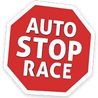

# AutoStopRace

Android app which allows participants of hitchhiking race to share their location.  
Project website: http://www.autostoprace.pl/  
Google Play: https://play.google.com/store/apps/details?id=pl.temomuko.autostoprace

# Architecture
Application built on MVP-based architecture powered by RxJava.  ([architecture guidelines by ribot](https://github.com/ribot/android-guidelines/blob/master/architecture_guidelines/android_architecture.md))

# Used libraries
* [ButterKnife](http://jakewharton.github.io/butterknife/)
* [Dagger 2](http://google.github.io/dagger/)
* [Eventbus](http://greenrobot.org/eventbus/)
* [Google Maps Android API utility library](http://googlemaps.github.io/android-maps-utils/)
* [Google Play Services](https://developers.google.com/android/)
* [GSON](https://github.com/google/gson)
* [LeakCanary](https://github.com/square/leakcanary)
* [MaterialDialogs](https://github.com/afollestad/material-dialogs)
* [MaterialProgressBar](https://github.com/DreaminginCodeZH/MaterialProgressBar)
* [OkHttp](http://square.github.io/okhttp/)
* [Opencsv](http://opencsv.sourceforge.net/)
* [Glide](https://github.com/bumptech/glide)
* [Retrofit](http://square.github.io/retrofit/)
* [Retrolambda](https://github.com/evant/gradle-retrolambda)
* [RxAndroid](https://github.com/ReactiveX/RxAndroid)
* [RxBinding](https://github.com/JakeWharton/RxBinding)
* [RxJava](https://github.com/ReactiveX/RxJava)

## License

    Copyright 2016 Szymon Kozak, Rafał Naniewicz

    Licensed under the Apache License, Version 2.0 (the "License");
    you may not use this file except in compliance with the License.
    You may obtain a copy of the License at

       http://www.apache.org/licenses/LICENSE-2.0

    Unless required by applicable law or agreed to in writing, software
    distributed under the License is distributed on an "AS IS" BASIS,
    WITHOUT WARRANTIES OR CONDITIONS OF ANY KIND, either express or implied.
    See the License for the specific language governing permissions and
    limitations under the License.
